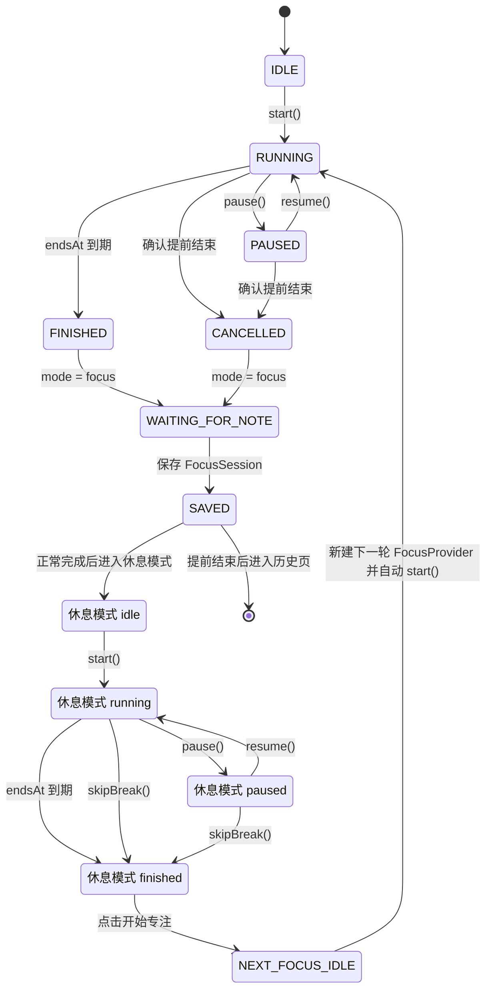

# 拾年 / CHRONA 番茄钟状态机

本文档描述当前 `FocusProvider` 的真实生命周期，以及页面层的“填写记录 / 保存”流程。运行时定义位于 [`lib/providers/focus_provider.dart`](../lib/providers/focus_provider.dart)。

## 1. 状态模型

### 1.1 代码中的实际状态

```dart
enum FocusTimerStatus { idle, running, paused, finished, cancelled }
enum FocusMode { focus, rest }
```

`FocusTimerStatus` 是计时器的实际状态；`FocusMode` 决定当前是专注还是休息。项目没有把 `WAITING_FOR_NOTE`、`SAVED` 定义成枚举，它们是计时结束后的页面 / 业务流程状态。

| 状态          | 含义                          | 进入方式                                  | 可执行操作                             | 下一状态                                          | 数据库 / FocusSession |
| ------------- | ----------------------------- | ----------------------------------------- | -------------------------------------- | ------------------------------------------------- | --------------------- |
| `idle`      | 计时器已创建但尚未开始        | `FocusProvider` 构造时                  | `start()`                            | `running`                                       | 不写库，不产生记录    |
| `running`   | 正在按`endsAt` 倒计时       | `start()` 或 `resume()`               | 暂停、提前结束；专注模式下可结束本轮   | `paused`、`finished`、`cancelled`           | 不写库                |
| `paused`    | 暂停 ticker，保留剩余秒数     | `pause()`                               | 继续、提前结束；休息模式可跳过         | `running`、`cancelled`；休息可到 `finished` | 不写库                |
| `finished`  | `endsAt` 到期，或休息被跳过 | `_refreshFromClock()` / `skipBreak()` | 专注模式进入记录页；休息模式开始下一轮 | 记录流程或新的休息 / 专注 Provider                | 仍未写库              |
| `cancelled` | 用户确认提前结束专注          | `cancel()`                              | 进入本轮记录页                         | 记录流程                                          | 仍未写库              |

### 1.2 页面流程状态

以下两个状态不是 `FocusTimerStatus`：

| 流程状态             | 含义                                                                                             | 数据行为                                                             |
| -------------------- | ------------------------------------------------------------------------------------------------ | -------------------------------------------------------------------- |
| `WAITING_FOR_NOTE` | `FocusScreen` 将 `finished` / `cancelled` 的专注结果交给 `FocusNoteScreen`，等待用户填写 | 暂不写`FocusSession`                                               |
| `SAVED`            | 用户保存本轮记录成功                                                                             | 插入一条`focus_session`；状态映射为 `COMPLETED` 或 `CANCELLED` |

## 2. 状态图



图中的 `BREAK_*` 仍然使用同一组 `FocusTimerStatus`，只是 `FocusMode` 为 `rest`；项目没有单独的 `BREAK` 枚举值。

## 3. 各状态和转换细节

### 3.1 `idle`

- `FocusProvider` 创建时状态为 `idle`，`remainingSeconds` 等于计划时长。
- `FocusScreen.initState()` 检测到 `idle` 后会自动调用 `start()`，所以正常用户流程通常不会长时间停留在 `idle`。
- 不创建数据库记录，也不预约通知。

### 3.2 `running`

进入 `running` 时：

```text
startedAt = now
endsAt = startedAt + plannedDurationSeconds
status = running
启动每秒 ticker
预约结束通知
```

真实剩余时间由 `endsAt.difference(now)` 计算，并向上取整到秒。ticker 只负责触发刷新，不是时间的唯一来源。

运行中点击时间圆环只切换显示方式：

- 默认显示剩余时间；
- `isCountUp = true` 时显示已经过的计划时间；
- 不改变 `endsAt`、状态或数据库数据。

### 3.3 `pause`

从 `running` 调用 `pause()` 时：

1. 先调用 `_refreshFromClock()`，防止暂停时漏掉已经到期的状态。
2. 保存 `pausedAt` 和 `pausedRemainingSeconds`。
3. 取消 ticker。
4. 清空 `endsAt`。
5. 取消结束通知。
6. 进入 `paused`。

如果刷新时已经发现到期，状态会先变成 `finished`，本次暂停不会生效。

暂停不会创建或更新 `FocusSession`。

### 3.4 `resume`

从 `paused` 调用 `resume()` 时：

```text
remainingSeconds = pausedRemainingSeconds
endsAt = now + remainingSeconds
清空暂停字段
status = running
恢复 ticker
重新预约结束通知
```

继续计时使用新的 `endsAt`，不会把暂停期间当成剩余专注时间消耗掉。

### 3.5 正常到期：`running → finished`

每次 ticker 刷新，或 App 恢复前台时，都会尝试根据 `endsAt` 更新状态。若剩余毫秒数小于等于零：

```text
remainingSeconds = 0
endedAt = now
status = finished
停止 ticker
```

专注模式下，`FocusScreen` 监听到 `finished` 后只打开一次 `FocusNoteScreen`；计时结束本身不会立即写入数据库。用户保存记录后才生成 `FocusSession`。

### 3.6 提前结束：`running / paused → cancelled`

- 只有专注模式显示“结束专注”确认流程；休息模式没有相同的提前结束按钮，而是提供“跳过休息”。
- 运行中提前结束会先刷新一次时间。
- 运行中或暂停状态都会设置 `endedAt = now`，停止 ticker，取消结束通知，并进入 `cancelled`。
- `cancelled` 同样进入 `FocusNoteScreen`，但保存后 `FocusSession.status = CANCELLED`。

当前实际时长计算为：

```text
actualDurationSeconds = endedAt - startedAt
```

因此暂停期间也会包含在实际时长中；这是当前代码行为，尚未单独扣除暂停时长。

### 3.7 `WAITING_FOR_NOTE`

`FocusScreen` 对专注模式的 `finished` 或 `cancelled` 状态执行一次页面跳转：

```text
FocusScreen
→ FocusNoteScreen(session: FocusProvider.sessionResult)
```

此阶段 `FocusProvider.sessionResult` 只提供内存中的时间、任务和状态结果，还没有 SQLite `id`，也没有写入 `focus_session`。

### 3.8 `SAVED`

点击“保存”后，`FocusNoteScreen`：

1. 校验任务标题不能为空。
2. 把文本框内容转成可空 `note`。
3. 创建 `FocusSession`。
4. 通过 `FocusSessionProvider.saveSession()` 插入 `focus_session`。
5. 如果任务标题被修改，再通过 `TaskProvider.updateTask()` 更新 `task.title`。

状态映射：

```text
FocusTimerStatus.finished  → FocusSessionStatus.completed → COMPLETED
FocusTimerStatus.cancelled → FocusSessionStatus.cancelled → CANCELLED
```

保存失败时停留在记录页并显示错误，不会进入下一页面。

保存成功后的路由不同：

- 正常完成：进入新的 `FocusMode.rest` 休息计时页。
- 提前结束：清理当前记录页路由并进入 `HistoryScreen`。

## 4. 休息模式 / `BREAK`

休息模式已经存在，但不是独立的状态枚举：

```text
FocusMode.rest + FocusTimerStatus.idle/running/paused/finished
```

### 4.1 进入和结束

- 正常专注记录保存后，根据 `FocusSettingsProvider.breakDurationSeconds` 创建休息页，默认 5 分钟。
- 休息自然到期时状态变为 `finished`，页面显示“准备开始下一轮”和“开始专注”。
- 休息中或暂停时点击“跳过休息”，调用 `skipBreak()`，设置 `endedAt`、`remainingSeconds = 0`、`status = finished`，并取消休息通知。
- 休息完成或跳过都不会生成 `FocusSession`，也不会打开本轮记录页。
- 用户点击“开始专注”后新建专注模式的 `FocusScreen`；下一轮不是同一个 FocusSession。

### 4.2 休息的暂停和继续

休息沿用和专注相同的 `pause()` / `resume()` 逻辑，包括清空并重算 `endsAt`、取消并重新预约通知。

## 5. 后台、锁屏和恢复前台

### 切后台 / 锁屏

- `FocusProvider` 注册了 `WidgetsBindingObserver`，但没有把计时器状态写入 SQLite。
- 计时真实依据仍是 `endsAt`，不是 Flutter ticker 是否持续运行。
- 开始或继续时，`NotificationService` 使用精确闹钟预约结束提醒。Android 13+ 通过 `USE_EXACT_ALARM` 自动获得权限；Android 12 通过 `SCHEDULE_EXACT_ALARM` 请求用户授权，未授权时以非精确闹钟降级并记录日志。
- App 从后台恢复时，Provider 先按 `endsAt` 校正计时；若计时仍在运行，会重新检查精确闹钟权限并更新结束提醒。用户从系统设置授予权限后，无需重新开始计时即可应用精确调度。
- 专注通知配置为不播放声音、开启震动；休息结束通知播放系统默认声音并震动。

### App 恢复前台

恢复到 `resumed` 时，`FocusProvider.didChangeAppLifecycleState()` 调用 `_refreshFromClock()`：

- `endsAt` 仍在未来：重新计算剩余时间，保持 `running`。
- `endsAt` 已到：设置 `endedAt`、切换到 `finished`，停止 ticker，并由页面进入记录流程。

通知的实际触发由系统本地通知完成，不依赖前台 ticker；但当前没有活动计时的持久化恢复机制。如果 App 进程已被系统杀死，代码没有从 SQLite 或 SharedPreferences 恢复一个未完成的 `FocusProvider`。

## 6. 到点通知和震动

### 专注结束

`start()` / `resume()` 调用 `scheduleFocusEnd()`：

- 使用 `endsAt` 作为调度时间；
- 使用当前任务标题和计划时长生成通知正文；
- `playSound = false`；
- 开启震动；
- 通知操作包含“停止提醒”；
- 使用一个固定通知 ID，新的预约会替换旧预约。

暂停、提前结束和跳过休息会调用 `cancelFocusEnd()` 取消预约。自然到点时 Provider 切换为 `finished`，代码不会主动调用取消；页面和通知操作仍可以执行“停止提醒”。

### 休息结束

休息模式调用 `scheduleBreakEnd()`：

- 通知标题为“休息结束”；
- 使用系统默认声音；
- 开启震动；
- 提示准备开始下一轮专注。

## 7. 数据库写入边界

```text
IDLE / RUNNING / PAUSED / FINISHED / CANCELLED
└─ 只存在于内存，不写 focus_session

WAITING_FOR_NOTE
└─ 等待用户输入，不写 focus_session

保存成功
└─ 插入一条 focus_session
   ├─ finished  → COMPLETED
   └─ cancelled → CANCELLED

休息模式
└─ 不生成 focus_session
```

任务表 `task` 只有在记录页修改任务标题时才会被更新；开始、暂停、完成或取消专注本身不会自动更新任务的 `completed` / `completed_at`。
